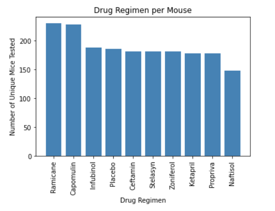
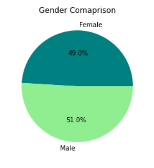
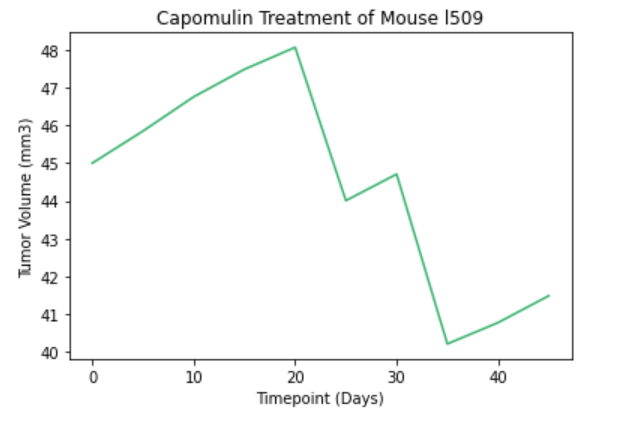

# Matplotlib Challenge

## Prompt
Using the provided dataset create visualizations and a top level report for a cancer pharmaceutical drug trial.
Create the following visualizations:
* Bar
* Pie
* Box and Whisker
* Line
* Scatter
* Correltation and Regression

## Process  
**Dependencies and Setup**  
* Pandas
* Matplotlib Pyplot
* Scipy 

**Data Cleaning**  
Based upon information provided about the dataset we know that no subject should have more then 10 timepoints. Using `value_counts()` to check we see that subject g989 has 13 entries. Using `.loc` we can see that id g989 is a duplicate. Once that is removed from the dataset we can use the clean dataset to create some graphs.

**Bar Chart**  
For overview of all the cancer drugs used in this study a bar chart is the best choice. The x-axis is created using `unique()` on the drug regimen column to get all the unique drugs used in the study. `value_counts()` is used on the drug regimen column to get the amount of use for each treatment. Labels are added as necessary. Matplotlib handles the rest and we get the following chart.

 

**Pie Chart**  
A pie chart is used to check the gender split in the dataset. This was we can see if any correlation can be drawn between treatments and genders. The count of each gender is calculated by using `.loc()` to select by each gender. A few extra parameters were added to the pyplot to format the percent and each gender was assigned a shade of green to help visually seperate the pie wedges.

 

**Box and Whisker Plot** 

**Line Plot** 
To show the tumor volume over time for subjects getting the Capomulin treatment the best option is a line plot. Passing the timepoint column for the x-axis and Tumor Volume (mm3) for the y-axis will generate that graph. Axes and Title are added for useability.

 

**Scatter Plot** 

**Correlation and Regression** 

